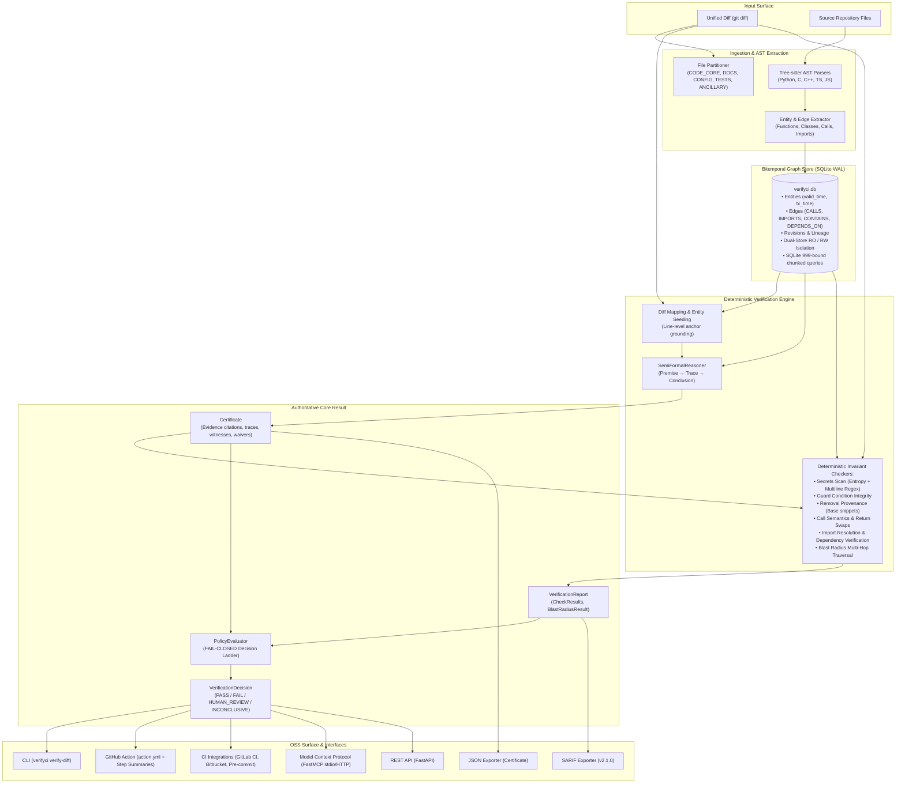

# VerifyCI System Architecture

VerifyCI is a local-first, verification-first code intelligence platform. It replaces probabilistic heuristics with deterministic mathematical verification: repository code is indexed into a bitemporal Code Property Graph (CPG), proposed diffs are grounded onto that graph, deterministic invariant and blast-radius checks execute, and an authoritative Certificate is evaluated by a fail-closed PolicyEvaluator.

---

## High-Level Verification Pipeline

---

## Architectural Subsystems

### 1. Frozen Contracts (`verifyci/contracts/`)
The foundation of VerifyCI consists of immutable, frozen dataclass schemas that define the boundary across all modules:
- **`Entity`**: Code entities (functions, methods, classes, modules) with bitemporal intervals (`valid_from`/`valid_until`, `t_created`/`t_expired`), location spans, and source hashes.
- **`Edge`**: Semantic relationships between entities (`CALLS`, `IMPORTS`, `CONTAINS`, `DEPENDS_ON`).
- **`Revision`**: Manifest of files and content hashes identifying a code state.
- **`Certificate`**: The authoritative verification object recording premises, file evidence snippets, execution traces, cryptographic waivers, and verification status.
- **`VerificationReport` & `CheckResult`**: Individual deterministic check outcomes, score, blocking flags, and grounding establishment.
- **`VerificationDecision` & `VerificationPolicy`**: Fail-closed policy evaluation decisions.
- **`jsonio`**: Canonical JSON serialization handling enums and nested dataclasses without schema drift.

### 2. Ingestion & AST Extraction (`verifyci/ingestion/`)
- Uses native **Tree-sitter** grammars for high-throughput, incremental parsing (Python, C, C++, TypeScript, JavaScript).
- Extracts code entities, spans, decorators, and call/import references.
- Classifies files using `FilePartition` (`CODE_CORE`, `DOCUMENTATION`, `CONFIGURATION`, `TEST_SUITE`, `ANCILLARY`).
- Employs deep recursion limits and falls back to coarse `MODULE`-level entities on pathological inputs without crashing.

### 3. Graph Storage & Concurrency Isolation (`verifyci/storage/`)
- Persistent SQLite database running in **Write-Ahead Logging (WAL)** mode for concurrent readers and atomic writers.
- **Dual-Store Boundary**:
  - Observation tools run on read-only store instances (`ro_store`) preventing write locks or journal flips.
  - Task executions use read-write store instances (`rw_store`) for ledger updates.
- **Bitemporal Semantics**:
  - *Valid time*: when the code was valid in the repository revision.
  - *Transaction time*: when the record was ingested into the database.
- **Chunked Query Bounds**: Bounded SQL parameters (max chunk 400) enforce strict compliance under the SQLite 999 parameter ceiling.

### 4. Verification Engine (`verifyci/verification/`)
- **`DiffMap`**: Maps unified diff lines to base code entities. Enforces the invariant that **every changed line must land inside a recognized entity span**. Stray edits outside spans force `INCONCLUSIVE`.
- **`SemiFormalReasoner`**: Constructs formal premises from diff hunks, traces call paths through the CPG, and outputs a signed `Certificate`.
- **`BlastRadius`**: Traverses call-graph paths to evaluate impacted callers, callees, and test coverage gaps.
- **`RemovalProvenance`**: Cross-references deleted `-` lines against stored base-revision snippets to catch stale or fabricated deletions.
- **`GuardCondition`**: Checks that defensive validation logic, bounds checks, or auth assertions are not inverted or deleted.
- **`SecretsScan`**: Scans added lines with multi-rule entropy, multiline continuation tracking, and regex patterns.
- **`PolicyEvaluator`**: Evaluates checks under strict fail-closed rules. Checks that did not establish grounding route to `INCONCLUSIVE`, never a false `PASS`.

### 5. Memory & Ledger (`verifyci/memory/`)
- **`EventLedger`**: Hash-chained audit ledger recording verification events and task decisions.
- **Tamper Evidence**: L1 ledger chaining with L2 external JSONL head anchoring (`verify-chain`).

### 6. Orchestration & DAG Scheduler (`verifyci/orchestration/`)
- Compiles intent packages into `TaskIR` and executes task DAGs via `AsyncDAGScheduler`.

### 7. Network & Multi-Platform Integration Surface
- **CLI (`verifyci.interface.cli`)**: Terminal command interface with standardized exit codes:
  - `0`: `PASS` (Established grounding, zero blocking check failures).
  - `1`: `FAIL` (Blocking check or invariant tripped).
  - `2`: `HUMAN_REVIEW` / `INCONCLUSIVE` (Ungrounded diff, policy edit, escalated).
  - `3`: `INFRA_ERROR` / `TIMEOUT` (DB missing/corrupt or task deadline exceeded).
- **Exporters (`verifyci.export`)**:
  - `export_certificate_json`: Stable machine-readable Certificate and Report serialization.
  - `export_sarif`: OASIS SARIF v2.1.0 output for GitHub Code Scanning.
- **Composite GitHub Action (`action.yml`)**: Local-first composite action verifying PR changes without SaaS dependencies, reporting structured results via `$GITHUB_STEP_SUMMARY`.
- **Multi-CI Pipelines (`docs/integrations/ci_pipelines.md`)**: Reference pipeline definitions for GitLab CI, Bitbucket Pipelines, and pre-commit hooks.
- **Model Context Protocol (`verifyci.interface.fastmcp_server`)**: FastMCP stdio/HTTP server allowing AI agents to query the graph and verify diffs interactively with diff size caps and loopback protection.
- **REST API (`verifyci.interface.http`)**: FastAPI HTTP server with loopback-default protection.
